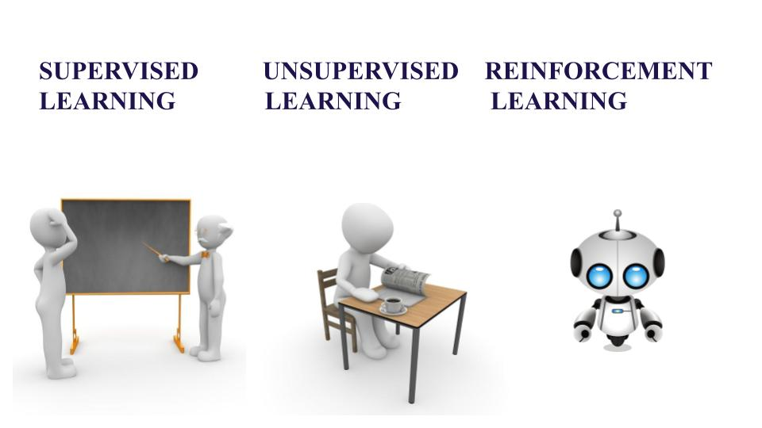

The Problem
======
This section emphasizes the importance of selecting the right problem when applying data science and machine learning (ML) to fluid mechanics. Data science involves asking and answering questions with data, and ML leverages historical data to build models for real-time predictions with new data. 

    Problem Selection: The problem should be both important and tractable, involving input data that will be available in the future and output data that represents the desired prediction. The relationship between inputs and outputs is what the ML model will learn.

    Types of ML Algorithms:

        Supervised Learning: Uses labeled training data where outputs are predicted from inputs. Tasks can be:
            Classification: Predicting discrete labels (e.g., identifying a "dog" or "cat" from an image).
            Regression: Predicting continuous labels (e.g., calculating lift or drag from airfoil geometry).

        Unsupervised Learning: Finds structure in data without labels, often called data mining. Tasks include:
            Clustering: Identifying and characterizing discrete groupings in data.
            Embedding/Dimensionality Reduction: Extracting continuous structure in data, e.g., using principal component analysis (PCA) or proper orthogonal decomposition (POD).

        Reinforcement Learning: An agent learns to make decisions to interact with an environment for high-level objectives, such as playing games like chess or Go.

  

Selecting the appropriate problem and determining the nature of input and output data are crucial steps that define the overall approach and type of ML algorithms to be used.

Embedding physics in the problem
======
Choosing what phenomena to model with machine learning (ML) is closely linked to the underlying physics. Traditionally, ML has been used for static tasks like image classification, but it is increasingly applied to model physical systems that evolve over time. Examples include:
Modeling conserved quantities, such as Hamiltonians, purely from data.
Representing time-series data as differential equations, where the learning algorithm captures the dynamical system.
Learning coordinate transformations to simplify dynamics, such as linearizing or decoupling them.

Examples in Fluid Mechanics
======
Machine learning is making significant contributions to various physical modeling tasks in fluid mechanics:
Turbulence Closure Modeling: Applying ML to learn models for Reynolds stresses or sub-grid scale turbulence.
CFD Solvers Improvement: Enhancing computational fluid dynamics (CFD) solvers with ML.
Super-Resolution: Improving resolution in fluid simulations.
Robust Modal Decompositions: Developing better methods for modal analysis.
Network and Cluster Modeling: Using ML for network and cluster analysis in fluid systems.
Control and Reinforcement Learning: Applying ML for fluid control and optimization tasks.
Design of Experiments: Enhancing experimental design in cyber-physical systems.
These problems inherently embed the learning process within a larger physics-based framework, ensuring that the ML models remain physically relevant and accurate.

