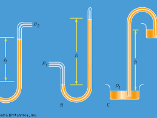
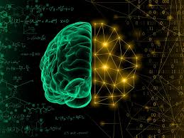
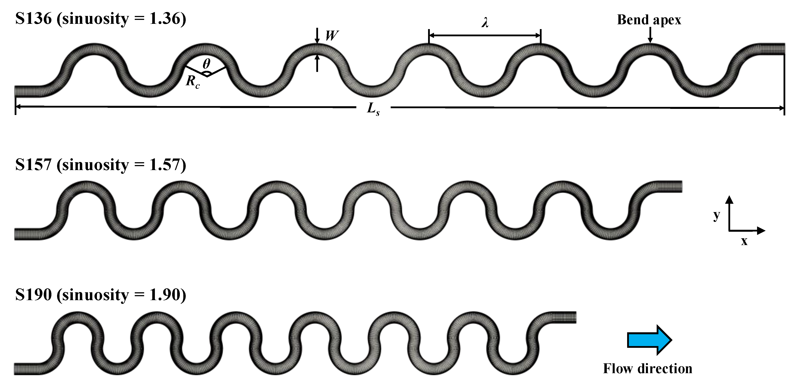
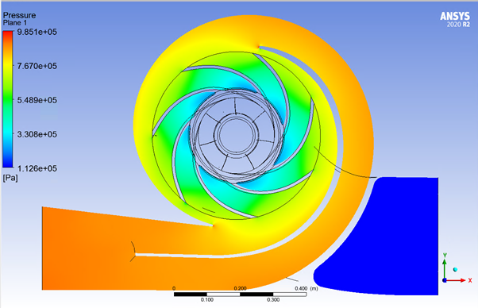
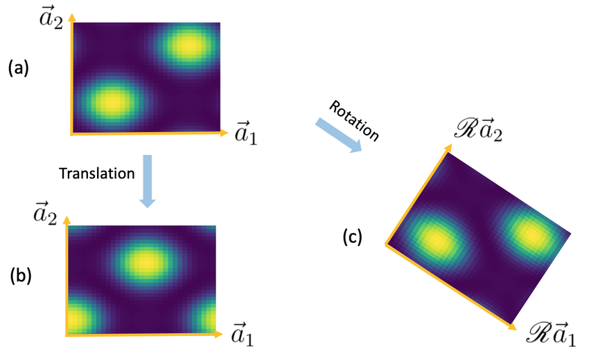
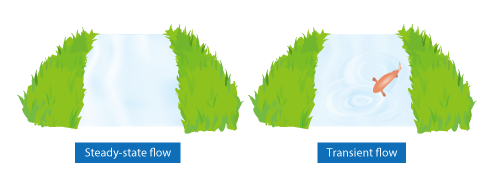
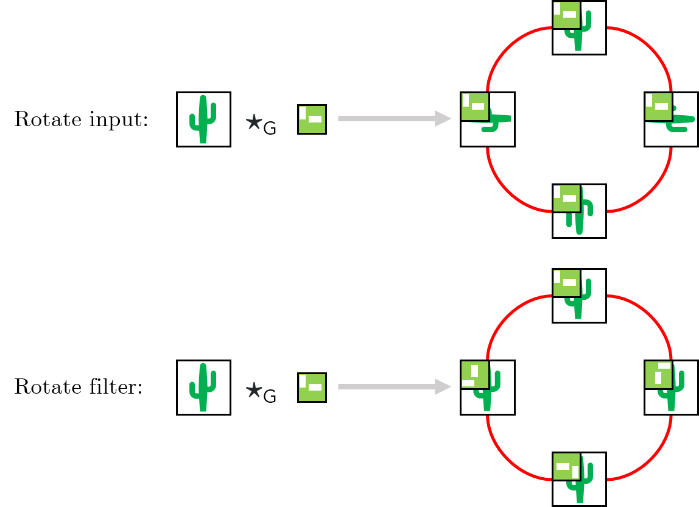
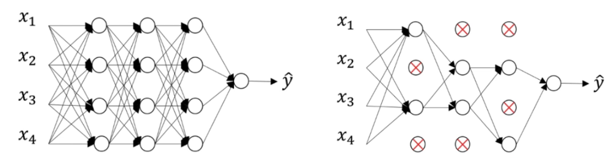
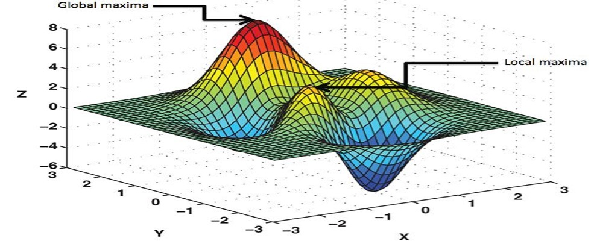

Introduction
======
 Fluid mechanics is data-rich and presents many complex optimization problems that ML is well-suited to handle. Examples include optimizing wing design, estimating flow fields, and controlling turbulence for various engineering applications.

 

 
  ML can provide surrogate models for fluid behaviors or directly solve fluid optimization tasks.
  The process of implementing ML in fluid mechanics is not automatic and requires expert human intervention at each step, from problem definition to model training and optimization. Despite the successes of ML in fields like computer vision and natural language processing, its application to physical sciences, including fluid mechanics, is still emerging and comes with both optimism and skepticism. 

  Researchers are eager to understand how to best integrate ML with existing research methods. While training ML models for well-defined tasks is relatively straightforward, creating models that outperform traditional methods remains challenging. Incorporating known physics into ML models can enhance their generalization, interpretability, and explainability, which are crucial for modern ML applications.

Physics-Informed Machine Learning
======
This section outlines the key steps in applying machine learning (ML) to fluid mechanics, emphasizing how prior physical knowledge can be integrated at each stage.

 

Choosing the Problem: Selecting the specific fluid mechanics issue to model or the question to answer.

Curating Data: Deciding on and preparing the data used to train the ML model.

ML Architecture: Selecting the appropriate ML architecture to best represent or model the data.

Designing Loss Functions: Creating loss functions to measure performance and guide the learning process.

Optimization Algorithm: Implementing algorithms to train the model by minimizing the loss function over the training data.

These steps are interconnected, often requiring iterative revisits and refinements based on outcomes at each stage. The discussion highlights the iterative nature of ML workflows, where researchers constantly refine the problem, data, architecture, loss functions, and optimization algorithms to enhance performance.

The section provides a high-level overview of embedding physics into ML processes and reviews examples specific to fluid mechanics, offering references for more detailed information .

The Problem
======
This section emphasizes the importance of selecting the right problem when applying data science and machine learning (ML) to fluid mechanics. Data science involves asking and answering questions with data, and ML leverages historical data to build models for real-time predictions with new data. 

Problem Selection: The problem should be both important and tractable, involving input data that will be available in the future and output data that represents the desired prediction. The relationship between inputs and outputs is what the ML model will learn.

Types of ML Algorithms:
Supervised Learning: Uses labeled training data where outputs are predicted from inputs. Tasks can be:

Classification: Predicting discrete labels (e.g., identifying a "dog" or "cat" from an image).

Regression: Predicting continuous labels (e.g., calculating lift or drag from airfoil geometry).

Unsupervised Learning: Finds structure in data without labels, often called data mining. Tasks include:

Clustering: Identifying and characterizing discrete groupings in data.

Embedding/Dimensionality Reduction: Extracting continuous structure in data, e.g., using principal component analysis (PCA) or proper orthogonal decomposition (POD).

Reinforcement Learning: An agent learns to make decisions to interact with an environment for high-level objectives, such as playing games like chess or Go.

  

Selecting the appropriate problem and determining the nature of input and output data are crucial steps that define the overall approach and type of ML algorithms to be used.

Embedding physics in the problem
======
Choosing what phenomena to model with machine learning (ML) is closely linked to the underlying physics. Traditionally, ML has been used for static tasks like image classification, but it is increasingly applied to model physical systems that evolve over time. Examples include:

Modeling conserved quantities, such as Hamiltonians, purely from data.

Representing time-series data as differential equations, where the learning algorithm captures the dynamical system.

Learning coordinate transformations to simplify dynamics, such as linearizing or decoupling them.

Examples in Fluid Mechanics
======
Machine learning is making significant contributions to various physical modeling tasks in fluid mechanics:

Turbulence Closure Modeling: Applying ML to learn models for Reynolds stresses or sub-grid scale turbulence.

  

CFD Solvers Improvement: Enhancing computational fluid dynamics (CFD) solvers with ML.

  
  

Super-Resolution: Improving resolution in fluid simulations.

Robust Modal Decompositions: Developing better methods for modal analysis.

Network and Cluster Modeling: Using ML for network and cluster analysis in fluid systems.

Control and Reinforcement Learning: Applying ML for fluid control and optimization tasks.

Design of Experiments: Enhancing experimental design in cyber-physical systems.

These problems inherently embed the learning process within a larger physics-based framework, ensuring that the ML models remain physically relevant and accurate.

The Data
======
Data is fundamental to machine learning (ML), determining the effectiveness of the models built. Key points include:
Interconnectedness with Problem Choice: Selecting data to inform a model is intrinsically linked to choosing the problem to model. This means that data selection cannot be separated from problem definition.

Impact on Model Quality: The quality and quantity of data directly impact the resulting ML model. Diverse and extensive training data are crucial, especially for architectures like deep neural networks, which function as sophisticated interpolation engines.
Example of Deep Learning Success: The rise of modern deep learning is attributed to the pairing of vast labeled datasets with novel deep learning architectures. A notable example is the success of deep convolutional neural networks in image classification, highlighted by their performance on the ImageNet database, which contains over 14 million labeled images across more than 20,000 categories. This large and rich dataset was instrumental in achieving high classification accuracy and marked the beginning of the modern era of deep learning.
Overall, the availability and diversity of data are critical for building effective and generalizable ML models.

Embedding physics in the Data
======
Training data can embed prior physical knowledge in several ways:

Symmetries: If a system exhibits symmetries like translational or rotational invariance, training data can be enriched with shifted or rotated examples.

Physical Intuition: Crafting new features using physical intuition, such as applying coordinate transformations to simplify representation or training.

Multifidelity Data: Combining data from multiple sources of different fidelity (e.g., simulations, experiments) is crucial, especially in fields like flight testing and unsteady aerodynamics. Recent advances include using physics-informed neural networks with multifidelity data to approximate partial differential equations (PDEs).

Examples in Fluid Mechanics
======
Fluids data is typically vast and high-dimensional, often requiring millions of degrees of freedom to characterize flow fields. These fields evolve over time, creating time-series data. Key points include:

Sparse Data: Despite the large spatial and temporal dimensions, data can be sparse in parameter space due to the high cost of investigating various geometries and Reynolds numbers.

Algorithm Design: There are algorithms designed for both rich and sparse data. In some cases, limited data may come from specific measurements, such as time-series data from a few pressure measurements on an airfoil or force recordings on an experimental turbine.

Transients: Observing system evolution during transients, when the system is away from its natural state, provides valuable insights.

Overall, embedding physical knowledge into training data and addressing the challenges of vast and high-dimensional fluids data are essential for effective machine learning applications in fluid mechanics.

The architecture 
======
Choosing an architecture to represent the machine learning (ML) model is crucial once the problem is identified, and data is collected and curated. A typical ML model is a function that maps inputs to outputs, often represented within a specified family of functions parameterized by θ. 

Function Representation:

ML models map inputs (x) to outputs (y) through a function f(x;θ).

Linear regression models outputs as a linear function of inputs, with θ parameterizing this linear map.

Neural Networks:

Powerful and Flexible: Neural networks can approximate complex functions given sufficient data and depth.

Variety of Architectures: The most common is the feedforward network, where data passes through an input layer, multiple computational layers, and an output layer.

Layer Composition: Each layer consists of nodes where data is processed through a weighted sum and a nonlinear activation function.

Parameters (θ): Determine the network weights and how data is passed between layers.

Network Topology: The architecture (number of layers, size, activation functions) is specified by the designer or through meta-optimization, determining the family of functions the network can approximate.

Optimization:

Network weights are optimized over the data to minimize a given loss function.

Alternative Architectures:
Not all ML architectures are neural networks. Other prominent models include:

Random Forests: A leading architecture for supervised learning.

Support Vector Machines: Another top architecture for supervised learning.

Bayesian Methods: Widely used, especially for dynamical systems.

Genetic Programming: Used for learning human-interpretable models and control.

Standard Linear and Generalized Linear Regression: Common for modeling time-series data.

Dynamic Mode Decomposition (DMD): Uses linear regression with a low-rank constraint to find dominant spatiotemporal structures.

Sparse Identification of Nonlinear Dynamics (SINDy): Uses generalized linear regression with sparsity-promoting loss functions or sparse optimization algorithms to identify differential equation models with minimal terms necessary to fit the data.

Overall, the architecture choice, from neural networks to alternative models, is essential for accurately representing the ML model and leveraging the data effectively.

Embedding physics in the architecture
======
Choosing a machine learning (ML) architecture provides a significant opportunity to embed physical knowledge into the learning process. Key methods include:

Convolutional Networks: Suitable for translationally invariant systems.

Recurrent Networks: Such as Long-Short Term Memory (LSTM) networks and reservoir computing, which are effective for systems evolving over time.

Equivariant Networks: Designed to encode various symmetries, improving accuracy and reducing data requirements.

Autoencoder Networks: Impose an information bottleneck to uncover low-dimensional structure in high-dimensional data.

Physics-Embedded Architectures: Incorporate structures like Hamiltonian or Lagrangian frameworks.

Physics-Informed Neural Networks (PINNs): Solve supervised learning problems while being constrained by governing physical laws.

Graph Neural Networks: Learn generalizable physics across various domains.

Deep Operator Networks: Learn continuous operators, such as governing partial differential equations, from limited training data.

2.3.2 Examples in Fluid Mechanics
======
Custom neural network architectures are used extensively to enforce physical solutions in fluid mechanics applications:

Galilean Invariance: Ling et al. designed a neural network layer enforcing Galilean invariance in Reynolds stress tensors.

Reynolds Stress Models: Developed using the SINDy sparse modeling approach.

Hybrid Models: Combining linear system identification with nonlinear neural networks for complex aeroelastic systems.

Hidden Fluid Mechanics (HFM): A physics-informed neural network strategy encoding Navier–Stokes equations, flexible to boundary conditions and geometry, for accurate flow field estimations from limited data.

Sparse Sensing: Used to recover pressure distributions around airfoils.

Fourier Neural Operator: Performs super-resolution upscaling and simulation modeling tasks.

Equivariant Convolutional Networks: Enforce symmetries in high-dimensional complex systems from fluid dynamics.

Subgrid-Scale Scalar Flux Modeling: Incorporate physical invariances into neural networks.

Deep Convolutional Autoencoder Networks: Integrated into reduced-order modeling frameworks for superior dimensionality reduction capabilities.

The Loss Function 
======
The loss function is a critical component in machine learning (ML) as it quantifies the performance of a model across various tasks.

Performance Measurement:
Commonly uses metrics like the L2 error, which measures the average difference between the model output and the true output over the input data.

Regularization:
Additional terms, such as the L1 or L2 norm of the parameters (θ), are included to promote simplicity (parsimony) and prevent overfitting. These norms penalize large parameter values, encouraging simpler models.

Balancing Objectives:
The loss function often balances multiple competing objectives, such as optimizing both model performance and model complexity.

Promoting Specific Behaviors:
Terms can be added to the loss function to encourage specific behaviors in different sub-networks within a neural network architecture.

Optimization Guidance:
The loss function provides essential information to approximate gradients, which are necessary for optimizing the model parameters.

In summary, the loss function is designed to measure and guide the model's performance, incorporating elements that ensure the model remains both effective and efficient. It balances various objectives and regularizes the model to prevent overfitting, ultimately facilitating the optimization process.

Embedding physics in the loss function
======
Embedding physics into the loss function involves creating custom terms to enhance the training of accurate models. 
Key aspects include:

Custom Loss Functions:
Designed for physics-informed architectures to promote efficient training.
Physical priors like sparsity can be incorporated using L1 or L0 regularization on parameters (θ), aligning with the principle of parsimony central to physical modeling.

Parsimony in Modeling:
Ensures a balance between model complexity and descriptive capability, essential for generalization.

Sparse Identification of Nonlinear Dynamics (SINDy):
Learns dynamical system models with minimal terms necessary to describe training data.
Different formulations include loss terms and optimization algorithms promoting physical notions like stability and energy conservation.

Stability and Energy Conservation:
Stability-promoting loss functions, based on Lyapunov stability, have shown impressive results, especially in fluid systems.

Examples in Fluid Mechanics
======

In fluid mechanics, embedding physics into the loss function has been extensively applied, particularly through sparse nonlinear modeling:

Sparse Nonlinear Modeling:
Uses sparsity-promoting loss terms to create parsimonious models that avoid overfitting and generalize well to new scenarios.
SINDy has been used to generate reduced-order models for the evolution of dominant coherent structures in flows.

Compact Closure Models:
Extended from SINDy to develop concise models for fluid dynamics.

Boundedness of Solutions:
Incorporates the physical concept of boundedness into the SINDy framework as a novel loss function, ensuring fundamental principles are maintained.

Divergence of Flow Field:
Adding terms to the loss function, such as the divergence of a flow field, to promote incompressibility in solutions.

In summary, embedding physics into the loss function involves integrating physical principles and constraints into the model training process. This approach ensures that ML models remain physically accurate, efficient, and capable of generalizing beyond the training data.

The Optimization Algorithm
======
Optimization algorithms are essential for training machine learning (ML) models by finding the parameters (θ) that best fit the training data. 

High-Dimensional and Non-Convex Problems:
ML optimization problems are typically high-dimensional and non-convex, creating challenging optimization landscapes with many local minima.
Few generic guarantees exist for convergence or global optimality in non-convex optimization.

Techniques for Convex Optimization:
There are powerful and generic techniques available for convex optimization problems.

Deep Neural Networks:
Modern deep neural networks have particularly high-dimensional parameters and require large training datasets.
Stochastic gradient descent algorithms are commonly used due to their effectiveness in handling large datasets and high-dimensional spaces.

Role of Optimization Algorithms:
Optimization algorithms are the engine powering ML, often abstracted from the decision process.
Advanced optimization algorithms are a major focus of research, aiming to improve convergence and performance.

Architecture and Loss Term Considerations:
When designing new architectures or incorporating novel loss terms, it is often necessary to explicitly consider the optimization algorithm to ensure effective training.

In summary, optimization algorithms are crucial for training ML models, especially in the context of high-dimensional and non-convex problems typical of modern deep learning. They enable the practical application of ML by finding the best-fitting parameters, and their development is a critical area of research to enhance model performance and efficiency.

Embedding physics in the Optimization Algorithm
======
Embedding physical knowledge into the optimization algorithm involves customizing or modifying it to incorporate prior physical constraints. Key methods include:

Adding Constraints:
Explicit constraints, such as ensuring certain coefficients are non-negative or satisfy specific algebraic relationships.
Enforcing physical properties like energy conservation or stability through constraints within the optimization process.

Custom Optimization Algorithms:
Developing algorithms tailored to minimize physically motivated loss functions, which are often non-convex.
The line between the loss function and optimization algorithm is often blurred due to their interdependence.
Examples include promoting sparsity with the non-convex L0 norm, where relaxed optimization formulations are used.

SR3 Optimization Framework:
The Sparse Relaxed Regularized Regression (SR3) framework is designed to handle challenging non-convex loss terms in physically motivated problems.

2.5.2 Examples in Fluid Mechanics
======
In fluid mechanics, embedding physics into optimization algorithms has shown practical applications:

Energy Conservation:
Loiseau demonstrated enforcing energy conservation for incompressible fluid flows by imposing skew-symmetry constraints on quadratic terms in a SINDy model.
These constraints are implemented as equality constraints on the sparse coefficients (θ) in the SINDy model.
The standard SINDy optimization procedure uses sequentially thresholded least-squares, allowing enforcement of these constraints at each regression stage via Karush-Kuhn-Tucker (KKT) conditions.

SR3 Optimization Package:
Developed to extend and generalize constrained optimization problems to more complex constraints and generic optimization issues.
This package illustrates the creation of custom optimization algorithms to train ML models with novel loss functions or architectures.

In summary, embedding physics into optimization algorithms involves incorporating physical constraints and developing custom algorithms to handle physically motivated, often non-convex, loss functions. This integration ensures that ML models remain physically accurate and efficient, with specific applications in fluid mechanics demonstrating the practical benefits of these methods.

Take-Home Message
======

Machine learning (ML) holds significant promise for addressing complex optimization problems in fluid mechanics by providing surrogate models or directly solving tasks. Successful implementation of ML in this field requires expert intervention at each step, from problem definition to model training and optimization. Integrating physical knowledge into ML models enhances their generalization, interpretability, and overall performance, which is crucial for advancing applications in fluid mechanics.

Overview of What Was Learned
======

Introduction to ML in Fluid Mechanics: ML is highly suited to handle the data-rich and complex optimization problems in fluid mechanics. It can optimize wing designs, estimate flow fields, and control turbulence but requires expert human intervention for successful implementation.

Physics-Informed Machine Learning: Key steps in applying ML to fluid mechanics include problem selection, data curation, choosing appropriate ML architectures, designing loss functions, and implementing optimization algorithms. Integrating prior physical knowledge at each step is essential for improving performance.

Problem Selection and Types of ML Algorithms: Selecting the right problem is crucial. Different types of ML algorithms (supervised, unsupervised, reinforcement learning) are suitable for various tasks such as classification, regression, clustering, and control.

Embedding Physics in the Problem: Embedding physical phenomena into ML models ensures that the models remain physically relevant. This includes modeling conserved quantities, representing time-series data as differential equations, and learning coordinate transformations.

Examples in Fluid Mechanics: ML contributes to turbulence closure modeling, improving CFD solvers, super-resolution, modal decompositions, network and cluster modeling, control, and design of experiments.

The Importance of Data: Data quality and quantity are fundamental to building effective ML models. Embedding physical knowledge into the data, using symmetries, physical intuition, and multifidelity data enhances model training.

Architecture and Embedding Physics: The choice of ML architecture is critical. Custom neural networks, convolutional networks, recurrent networks, and physics-informed neural networks are used to embed physical knowledge into the model.

Loss Function: The loss function measures model performance and guides optimization. Embedding physics into the loss function involves custom terms that promote efficient training and physical accuracy.

Optimization Algorithms: These algorithms are essential for training ML models. Embedding physics into the optimization process involves adding constraints and developing custom algorithms to handle non-convex loss functions.

Conclusion
======

Integrating machine learning into fluid mechanics presents exciting opportunities and challenges. While ML can significantly enhance the understanding and optimization of fluid behaviors, it necessitates a careful and expert-guided approach to problem selection, data curation, architecture design, and optimization. Embedding physical knowledge into ML models at every step is crucial for achieving accurate, interpretable, and efficient solutions. The iterative nature of ML workflows underscores the need for continuous refinement and integration of domain-specific knowledge to leverage the full potential of ML in fluid mechanics.

References
======

Brunton, S. L., Noack, B. R., & Koumoutsakos, P. (2020). Machine learning for fluid mechanics. Annual Review of Fluid Mechanics, 52, 477-508.
Raissi, M., Perdikaris, P., & Karniadakis, G. E. (2019). Physics-informed neural networks: A deep learning framework for solving forward and inverse problems involving nonlinear partial differential equations. Journal of Computational Physics, 378, 686-707.
Ling, J., Kurzawski, A., & Templeton, J. (2016). Reynolds averaged turbulence modelling using deep neural networks with embedded invariance. Journal of Fluid Mechanics, 807, 155-166.
Loiseau, J.-C., & Brunton, S. L. (2018). Constrained sparse Galerkin regression. Journal of Fluid Mechanics, 838, 42-67.
Raissi, M., Yazdani, A., & Karniadakis, G. E. (2020). Hidden fluid mechanics: Learning velocity and pressure fields from flow visualizations. Science, 367(6481), 1026-1030.
Kutz, J. N. (2017). Deep learning in fluid dynamics. Journal of Fluid Mechanics, 814, 1-4.
Rudy, S. H., Brunton, S. L., Proctor, J. L., & Kutz, J. N. (2017). Data-driven discovery of partial differential equations. Science Advances, 3(4), e1602614.